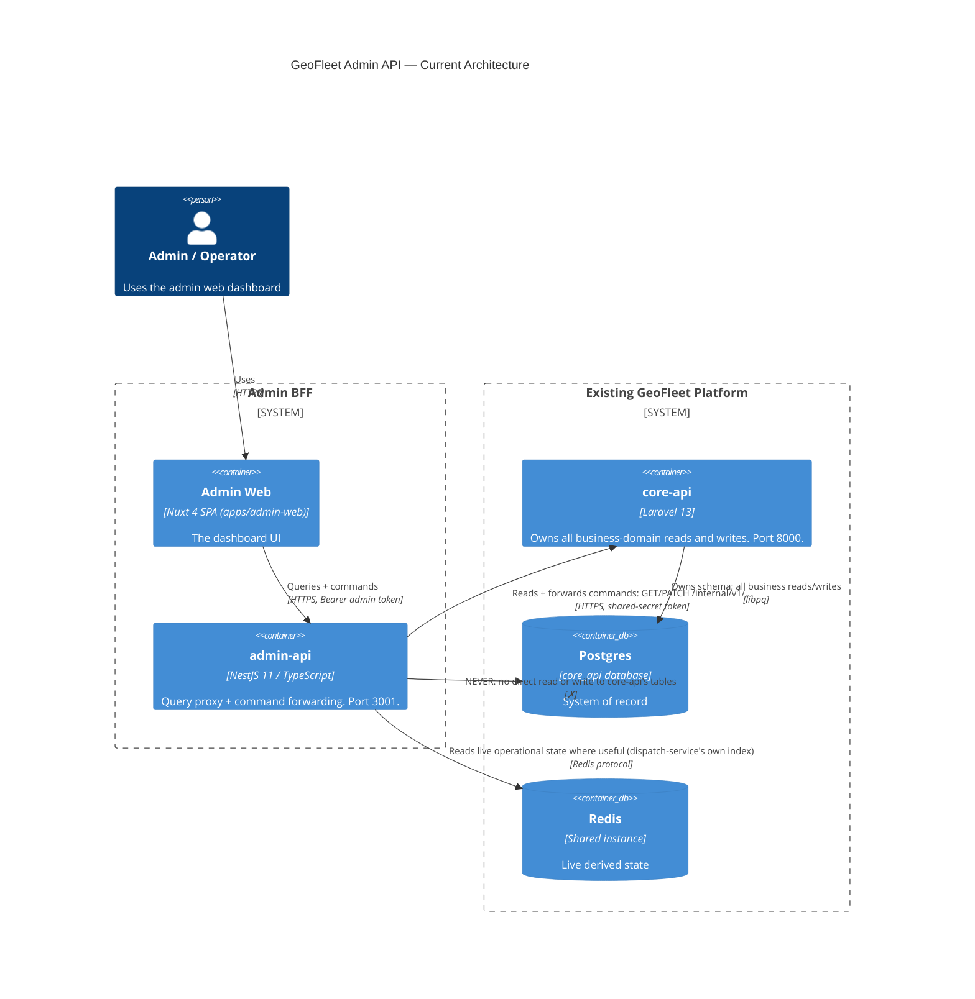

# admin-api: Architecture

## Target container view



The last relationship is drawn deliberately to make the forbidden edge
visible, not to describe real traffic — see "Critical architecture rule"
below. No Kafka in this diagram: admin-api ran a Kafka-projection
read model through Phase 4/5, then retired it — see "Kafka projections
retired" below.

## What's actually built (all 7 phases complete)

The diagram above was drawn as a *target* architecture in Phase 0/1; as of
Phase 7 it is the *actual* one — every relationship it draws is real,
live-verified traffic, not aspiration. Per phase (see
[overview.md](overview.md) for the full phase-by-phase detail and what
each one's own live verification found):

- **Phase 1** — HTTP server, config validation, structured logging,
  correlation-id propagation, response/error envelope, `/health` +
  `/ready`, Prometheus `/metrics`, Swagger at `/docs`.
- **Phase 2** — Sanctum-token verification against Postgres directly (no
  call back into core-api), `AuthGuard`/`PermissionsGuard`, log-only audit
  foundation.
- **Phase 3** — the `admin_read` schema, owned outright by the `admin_api`
  role; Kysely migrations for 5 projection tables + inbox + region
  metrics.
- **Phase 4** — one Kafka consumer, 9 live topics, idempotent per-handler
  inbox pattern, `fromBeginning: true` historical backfill.
- **Phase 5** — 11 cursor-paginated, permission-gated query endpoints
  across dashboard/drivers/rides/trips/payments.
- **Phase 6** — core-api's `internal/v1/*` API (shared-secret
  authenticated) and 3 forwarded commands (`drivers.suspend`,
  `trips.cancel`, `payments.refund`), each landing as a real Postgres
  write, an `audit_logs` row, and — where a topic exists for it — a Kafka
  event.
- **Phase 7** — the only Redis reads beyond a health ping: a throttled,
  region-scoped live driver map, live driver counters, and a computed
  incident feed, all sourced from dispatch-service's own Redis index.

Nothing in the original target diagram was unbuilt or stubbed by the end
of Phase 7. It has since changed shape — see the next section.

## Kafka projections retired — reads go straight to core-api

Phases 3/4 built a Kafka-projected `admin_read` schema (5 tables + an
inbox) as admin-api's own read model, consumed from 9 live topics. That
architecture is gone: `DashboardService`/`DriversService`/`RidesService`/
`TripsService`/`PaymentsService`/`RealtimeService` now call core-api's
own `internal/v1` read endpoints directly and synchronously (see
[query-apis.md](query-apis.md)), the same shared-secret boundary Phase 6
already built for commands. `KafkaModule`, every projection handler, the
Kysely `DatabaseModule`, and the `admin_read` schema itself (dropped via
migration on core-api's side) are all deleted, not just unused.

**Why**: admin traffic is low-volume — a handful of operators polling a
dashboard, not a customer-facing surface under real load. The eventual-
consistency lag a Kafka projection buys (decoupling read load from
core-api under high query volume) wasn't a real problem this project
had; it *was* paying real, ongoing costs — a second schema to migrate,
a consumer process that could silently drop behind, and (the concrete
bug this surfaced) admin-web's own list views permanently unable to
reflect state that only a Kafka event carried, because some real fields
(a driver's name, an accurate current status) either never made it into
an event payload or required extending one. Reading `drivers`/
`ride_requests`/`trips`/`payments` directly gives every field core-api's
own tables actually have — including a driver's real name, something no
event ever carried — with no event-schema design step in between.

**What was lost, honestly**: `admin_trip_projection`/
`admin_payment_projection` staying empty (no `trip.*`/`payment.*`
producer in core-api) is no longer a read-side gap at all — `trips`/
`payments` are queried directly, so `GET /trips`/`GET /payments` return
real rows the moment core-api's own tables have any (there just aren't
many yet, a genuinely separate gap: nothing creates `trips` rows from a
completed ride today). The ride-lifecycle timeline lost its finer
`search_started_at`/`assigned_at`/`unavailable_at` milestones — those
only ever existed as distinct Kafka event timestamps with no real-table
column behind them; the timeline core-api now returns uses
`ride_requests`' own `requested_at`/`accepted_at`/`cancelled_at`
instead, real columns, just fewer of them. And a driver's live GPS
position genuinely isn't in core-api's own tables at all (that's
location-service's/dispatch-service's Redis, not core-api's Postgres) —
`RealtimeService` still reads Redis directly for that; nothing else in
this platform could serve it.

## Critical architecture rule: query/command separation

core-api owns core business operations and durable domain logic. admin-api
must never perform a business-state mutation (cancel a trip, assign a
driver, refund a payment, suspend a driver, ...) by writing directly to a
core-api-owned Postgres table — and, since the Kafka-projection retirement
above, must never read one directly either. Both commands and queries go
through core-api's own `internal/v1` API, never admin-api's own copy of
core-api's tables (there isn't one anymore).

```
Commands:  Admin Web -> admin-api -> core-api internal/v1 (PATCH) -> domain logic -> Postgres -> outbox -> Kafka
Queries:   Admin Web -> admin-api -> core-api internal/v1 (GET)   -> Postgres -> admin-api -> Admin Web
```

**Why**: every hard invariant this platform relies on — the transactional
outbox, inbox idempotency, atomic ride acceptance (see the root
[AGENTS.md](../../AGENTS.md)) — is implemented once, inside core-api (and,
for the narrow slice each owns, the three Go services). Letting a second
service write to those same tables would mean re-implementing (or, more
likely, quietly violating) those invariants from a second, independent
codebase. This is the same reasoning that already kept dispatch-service
and realtime-gateway from getting broad write access to core-api's schema
(see [ADR 0005](../decisions/0005-geohash-and-dispatch-db-access.md),
[ADR 0006](../decisions/0006-realtime-gateway-fanout.md)) — admin-api is
held to a *stricter* version of the same rule: those two Go services at
least got narrow, audited grants for the one write each strictly needs
(dispatch-service's offer acceptance, nothing for realtime-gateway).
admin-api gets none, because it has no equivalent single-row-conditional-
UPDATE need — every admin command is inherently a multi-step business
decision (a cancellation reason, a refund amount, an audit trail) that
belongs in the domain layer, not a BFF.

## Technology choices (Phase 1)

| Concern | Choice | Why |
|---|---|---|
| Runtime | Node 22 LTS | No existing Node convention in this repo (core-api's `package.json` is Vite/Tailwind tooling only) — current LTS, stated explicitly rather than left implicit. |
| Framework | NestJS 11 | Explicitly requested; mature, actively maintained, and its module/DI system matches this platform's existing "own config, own logger, own metrics registry per service" convention naturally. |
| Config validation | `@nestjs/config` + Joi | Fails fast on boot with a clear message if the environment is misconfigured — same intent as core-api's `.env.example` conventions, enforced at startup instead of documented only. |
| Logging | `nestjs-pino` | Structured JSON logs, matching core-api's `Log::shareContext` and every Go service's `log/slog` usage — one correlation id shared across every log line for a request. |
| Health checks | `@nestjs/terminus` | Standard NestJS health-check plumbing (per-indicator up/down, automatic 503 on failure) — mirrors the shape of each Go service's own `Pinger`-based `/readyz` handler without hand-rolling the same thing a third time. |
| Metrics | `prom-client`, own `Registry` | Same "own registry, not the global default" rule every Go service's `internal/metrics` package already follows. |
| HTTP client (core-api calls) | `@nestjs/axios` | `CoreApiClientService` — every command *and* query goes through this one client now (see "Kafka projections retired" above); timeout, correlation-id propagation, structured errors, shared-secret header. |
| Kafka client | ~~`kafkajs`~~ | Removed. Backed Phase 4's projection consumer; no longer used anywhere in admin-api since that consumer was retired. |
| Redis client | `ioredis` | Used today only for the `/ready` ping; mature, actively maintained, the most common choice in the NestJS ecosystem — will back any Phase 7 live-state reads. |
| Security headers | `helmet` | Standard, low-risk hardening with no functional trade-off. |
| Rate limiting | `@nestjs/throttler`, global default (100 req/min/IP) | A conservative floor applied now so even `/health`/`/docs` aren't unprotected; Phase 2 will add a tighter, endpoint-specific policy once real auth/command endpoints exist (mirrors core-api's `throttle:auth` on `/auth/*`). |
| Response/error envelope | Hand-rolled interceptor + filter | Small enough not to need a library; shape deliberately mirrors core-api's `App\Support\ApiError` (`{ error: { code, message, correlation_id } }`) so admin-web never has to special-case which backend produced an error. |

Database ORM (Kysely, recommended in Phase 0) isn't installed yet — that
choice becomes real in Phase 3 alongside the first actual schema.

## Correlation-id propagation

Same convention as the rest of the platform
([docs/events/event-envelope.md](../events/event-envelope.md)): reuse a
client-supplied `X-Correlation-Id` if present and a valid UUID, otherwise
generate one. `src/common/middleware/correlation-id.middleware.ts` sets it
before anything else runs; `nestjs-pino`'s `genReqId` reuses the same
value so request logs, the error envelope, and the response header always
agree. Phase 6 will propagate it onward into core-api internal API calls
the same way core-api's own `AssignCorrelationId` middleware already
shares it into `Log::shareContext` and the outbox envelope.
