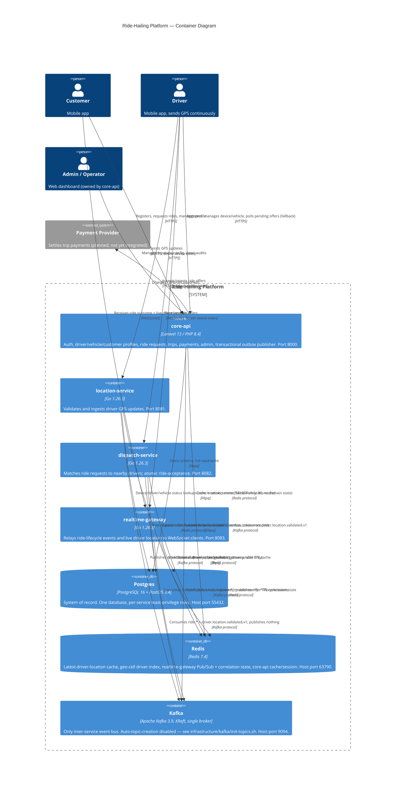

# Container Diagram

This is the C4-style *container* view [system-context.md](system-context.md)
has deferred since Phase 0 ("added when those services exist"): the four
deployable services, the three shared infrastructure containers, and the
protocols/credentials between them. Everything here reflects what's
actually built and running, not a target architecture — see
[data-flow.md](data-flow.md) for how data actually moves through these
containers over Kafka, and [scalability.md](scalability.md) for how each
one behaves under load.

## Diagram

## Containers

| Container | Tech | Port | Owns |
|---|---|---|---|
| [core-api](../../apps/core-api/README.md) | Laravel 13 / PHP 8.4 | 8000 | Auth, customer/driver/vehicle profiles, ride requests, trips, payments, admin, the transactional outbox |
| [location-service](../../apps/location-service/README.md) | Go 1.26.3 | 8081 | GPS ingestion + validation, "latest location" cache |
| [dispatch-service](../../apps/dispatch-service/README.md) | Go 1.26.3 | 8082 | Nearby-driver matching, ride offers, atomic acceptance |
| [realtime-gateway](../../apps/realtime-gateway/README.md) | Go 1.26.3 | 8083 | WebSocket push of ride-lifecycle events + live location |

None of the three Go services own domain data beyond the narrow Postgres
slice AGENTS.md's least-privilege convention grants them — core-api is the
only container with unrestricted access to its own schema. Every Go
service's exact grant is a per-service ADR: location-service
([0004](../decisions/0004-location-service-postgres-read-access.md)),
dispatch-service ([0005](../decisions/0005-geohash-and-dispatch-db-access.md)),
realtime-gateway ([0006](../decisions/0006-realtime-gateway-fanout.md)).

## Shared infrastructure

| Container | Used by | For |
|---|---|---|
| Postgres 16 + PostGIS 3.4 | all four services | System of record. One physical database, one role per service (`location_service`, `dispatch_service`, `realtime_gateway`; core-api connects as the migration-owning role). No service reads or writes another's tables outside its granted role. |
| Redis 7.4 | all four services | Four unrelated uses sharing one instance: location-service's latest-location/rate-limit keys, dispatch-service's geohash driver index, realtime-gateway's Pub/Sub channels + correlation state, and core-api's framework cache/session store (`CACHE_STORE=redis`, `SESSION_DRIVER=redis` — this one carries no domain data at all, unlike the other three). |
| Kafka 3.9 (KRaft, single broker) | all four services | The only inter-service event bus (AGENTS.md hard invariant — no service calls another's HTTP API for anything on the write path, except the driver-facing accept/reject calls dispatch-service itself serves). See [topic-catalog.md](../events/topic-catalog.md) for every topic and [data-flow.md](data-flow.md) for how events actually move end to end. |

## Authentication credentials by container

Three distinct credentials, reused across services rather than each
service inventing its own (see ADR
[0005](../decisions/0005-geohash-and-dispatch-db-access.md#dispatch-services-postgres-access)/[0006](../decisions/0006-realtime-gateway-fanout.md#reusing-existing-auth-not-inventing-a-third-mechanism)):

- **Driver device token** (`Authorization: Bearer <device_token>`, SHA-256
  hashed, `driver_devices.token_hash`) — issued by core-api
  (`POST /api/v1/driver/devices`), verified independently by
  location-service, dispatch-service, and realtime-gateway, each against
  its own least-privilege Postgres role.
- **Customer/driver Sanctum token** (`{id}|{plaintext}`) — issued by
  core-api (`POST /api/v1/auth/login`), verified by core-api itself for
  its own REST API and by realtime-gateway for the customer WebSocket
  endpoint (replicating Sanctum's own lookup, not calling back into
  core-api).
- **Admin session** — core-api only, standard Laravel session auth
  (`SESSION_DRIVER=redis`), not used by any Go service.

No service calls another service's HTTP API to authenticate a request —
every credential is verified locally against Postgres, which is why
realtime-gateway's Postgres role (read-only, auth-only) exists at all
despite the service holding no other domain state.

## What this diagram intentionally excludes

- Internal package/module structure within each container — see each
  service's own README (`## Structure`) for that.
- Deployment topology (how many instances, load balancer, Kubernetes,
  etc.) — this repo runs everything as a single instance per service
  locally (AGENTS.md: no Kubernetes manifests, no autoscaling config in
  scope). [scalability.md](scalability.md)'s "path to ~20k GPS
  updates/sec" section describes what multi-instance deployment of these
  same containers would look like, without prescribing an orchestrator.
- The payment provider integration — reserved in the schema and topic
  catalog (`payment.*.v1`) but never built (see
  [topic-catalog.md](../events/topic-catalog.md)'s Payments section);
  shown here only as the one planned external dependency the brief
  describes.
