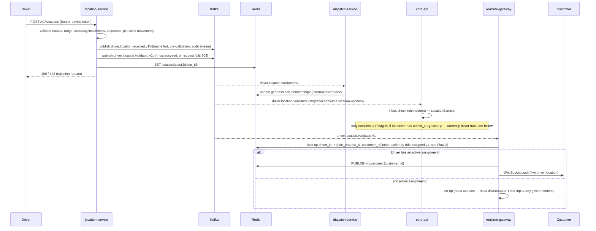
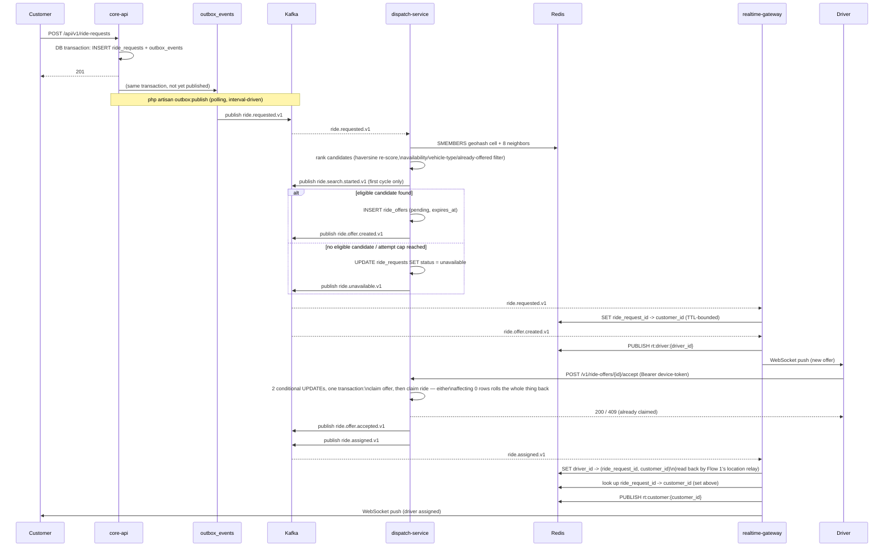
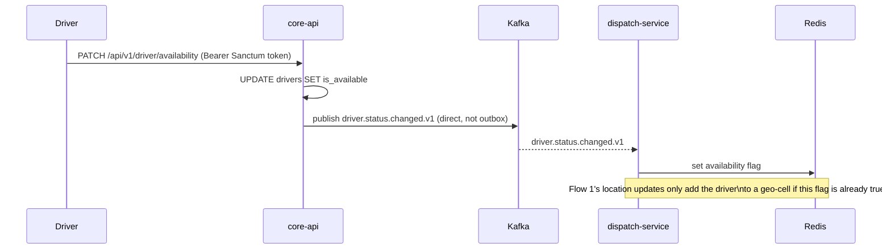
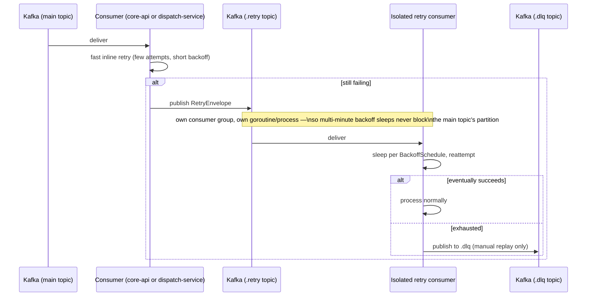

# Data Flow

This is the Kafka data-flow doc [system-context.md](system-context.md) has
deferred since Phase 2 ("added alongside the outbox publisher"). It traces
how an event actually moves between containers for the platform's three
live end-to-end flows, grounded in
[docs/events/topic-catalog.md](../events/topic-catalog.md) (the
authoritative producer/consumer map — this doc doesn't repeat partition
counts or keys, it shows the paths those topics form) and
[container-diagram.md](container-diagram.md) (which container does what).
Every topic named below is **live** per the topic catalog's status legend
unless a step says otherwise.

## Flow 1 — GPS ingestion, matching input, and live tracking

A driver's GPS ping fans out to three independent consumers, each for a
different reason. None of them talk to each other directly — Kafka is the
only coupling.

**Why three consumers, not one fan-out point**: each has a different
purpose and a different reliability requirement, so each is its own
consumer group rather than one service redistributing the event
internally — dispatch-service's index update is best-effort/self-healing
(next ping corrects it), core-api's sample is durable and idempotent (inbox
pattern, retry/DLQ-backed as of Phase 7), realtime-gateway's relay is
fire-and-forget (a missed push is invisible if the customer's app
reconnects and polls, same fallback Phase 5 already provides).

**`trip.location.updated.v1` is reserved but not yet real traffic.**
core-api's `LocationSampler` only writes a trip GPS sample (and would then
publish this event via the transactional outbox) when the driver has a
`trips` row with `status = 'in_progress'` — and nothing in core-api creates
`trips` rows yet, because no consumer of `ride.assigned.v1` exists there
(see [ADR 0006](../decisions/0006-realtime-gateway-fanout.md)'s scope
boundary). So this diagram's core-api branch runs on every GPS ping today,
but its downstream publish never fires. realtime-gateway deliberately
doesn't consume `trip.location.updated.v1` for the same reason (untestable
against an event that can't arrive) — it relays live location straight
from `driver.location.validated.v1` instead, using the correlation state
described in Flow 2.

## Flow 2 — Ride request, matching, offer, acceptance

The longest chain in the platform, and the one AGENTS.md's atomic-
acceptance invariant is about. `ride_request_id` keys every event in this
flow so one dispatch-service consumer instance sees them in order.

**Rejection and expiry re-enter the same cycle, they don't branch to new
code.** If the driver instead calls `POST /v1/ride-offers/{id}/reject`, or
`internal/expiry`'s background sweep finds an offer past `expires_at`,
dispatch-service re-runs `Matcher.RunCycle` for the same
`ride_request_id` — this diagram's matching branch, not a separate flow.
That's also why there's no `ride.offer.expired.v1` or `ride.cancelled.v1`
topic: the *outcome* (another offer, or `ride.unavailable.v1`) is what
other services react to, and a plain conditional Postgres `UPDATE`
already makes customer-initiated cancellation correct without a Kafka
round-trip (see the topic catalog's note on `RideRequestController::cancel()`).

**`ride.assigned.v1` and `ride.unavailable.v1` are published directly by
dispatch-service, not through core-api's outbox** — see
[ADR 0005](../decisions/0005-geohash-and-dispatch-db-access.md#why-dispatch-service-does-not-get-a-transactional-outbox)
for why the preceding conditional `UPDATE` already establishes correctness,
making the outbox pattern's atomicity guarantee unnecessary here.

## Flow 3 — Driver availability

Short, but it's the flow Phase 8's load-testing work (see
[scalability.md](scalability.md)) depended on getting right: a driver who
never fires this event is invisible to matching regardless of how many
GPS updates they send, because `driverindex` only adds a driver to its
geohash cell when Redis already has them marked available.

## Flow 4 — Retry and dead-letter (failure path)

Only two consumers in the platform get this treatment — see
[ADR 0007](../decisions/0007-retry-dlq-strategy.md) for why just these two
(every other consumer is self-healing or has a documented client-side
fallback) and [retry-and-dlq.md](../events/retry-and-dlq.md) for the full
envelope shape and manual replay procedure. Shown here only to place it in
the overall flow: it's a side path off Flow 1's core-api branch and Flow
2's dispatch-service branch, not a separate topic chain from scratch.

## What this doc intentionally excludes

- Planned-but-not-live topics (`trip.started.v1`, `trip.completed.v1`,
  `trip.cancelled.v1`, `payment.*.v1`, `notification.requested.v1`) — see
  [topic-catalog.md](../events/topic-catalog.md) for what's reserved and
  why each is deferred to a later, not-yet-scheduled phase.
- Per-topic partition counts, keys, and exact payload shapes — the topic
  catalog and [event-envelope.md](../events/event-envelope.md) are the
  source of truth for those; this doc only shows the paths they form.
- Multi-instance/multi-partition behavior — every flow above is drawn as
  if one instance of each service is running, which is what local dev
  actually runs. [scalability.md](scalability.md) covers what changes (and
  what doesn't) with more instances.
