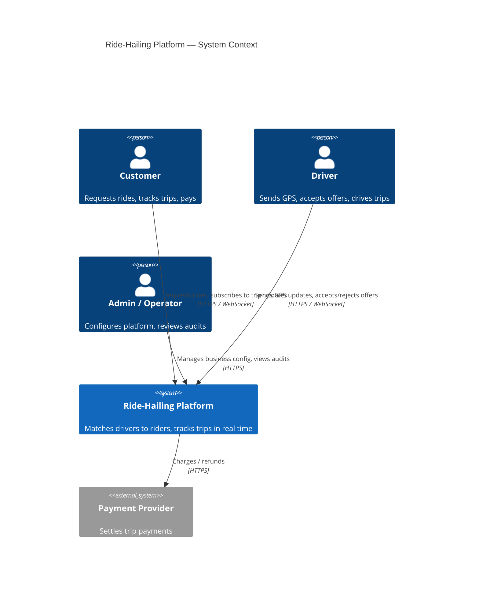

# System Context

This is a C4-style *system context* view: the platform as a single black
box, its human actors, and the external systems it depends on. Internal
service boundaries (core-api, location-service, dispatch-service,
realtime-gateway, admin-api) are documented separately in
[container-diagram.md](container-diagram.md) — showing them here would be
speculative at the system-context level of detail.

## Actors and external systems

- **Customer** — books rides via a mobile app, tracks driver location and
  trip status in real time, pays for trips.
- **Driver** — receives ride offers, accepts/rejects them, sends GPS
  updates continuously while online, completes trips.
- **Admin / Operator** — manages business configuration, views audit logs,
  operates the platform via an admin dashboard.
- **Payment provider** (external, out of scope for MVP implementation but
  modeled in the domain) — settles trip payments.

## Diagram

## Regional framing

The platform is designed to eventually route trip-related traffic by
`region_id` (e.g. `amman`, `irbid`, `aqaba`) — see the brief's "Regional
Architecture" section. For local development and through the first several
phases, a single region (`amman`, see `.env.example`) is used everywhere.
`region_id` is still carried on relevant records and events from day one
(Phase 2 schema, event envelope) so multi-region routing is additive later
rather than a schema migration.

## What this document intentionally excludes

- Internal service boundaries and their interactions — see
  [container-diagram.md](container-diagram.md).
- Data flow through Kafka topics — see [data-flow.md](data-flow.md).
- Capacity/scalability numbers — see [scalability.md](scalability.md).

All three were genuine gaps this document flagged since Phase 0/2; all
three are now filled as a post-phase-8 follow-up (not part of any single
phase's explicit deliverable) — see the repo root `README.md`.
