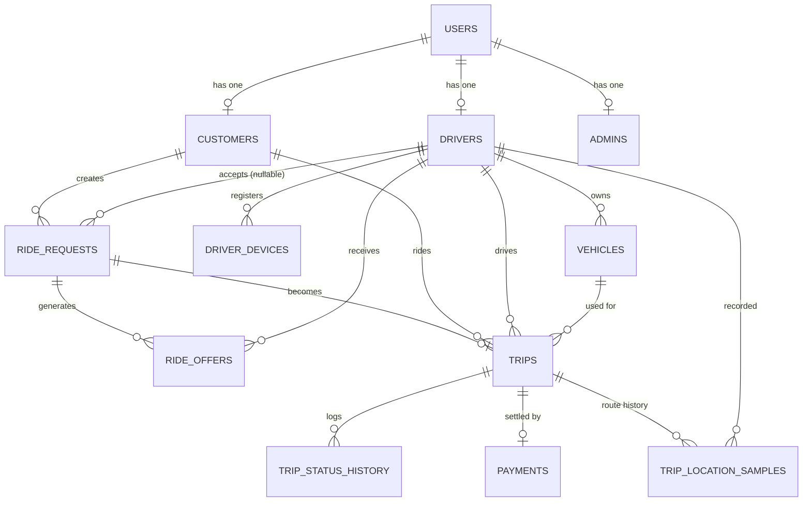

# Database Schema Overview

Tables created in Phase 2 (`apps/core-api/database/migrations/`), all owned
by core-api. See [indexes.md](indexes.md) for the index catalog and the
query each one supports, and
[docs/decisions/0002-postgres-postgis.md](../decisions/0002-postgres-postgis.md)
for why Postgres/PostGIS was chosen and the (longitude, latitude) point
ordering convention.

## Identifier convention

Every table has two identifier columns:

- `id` — internal bigint, auto-incrementing primary key. Used for foreign
  keys and joins only. Never exposed via the API.
- `uuid` — public identifier (`gen_random_uuid()` default), unique. This is
  what API responses and route parameters use (see
  `App\Models\Concerns\HasUuidRouteKey`). `outbox_events`/events use
  `event_id` (uuid) as their own separate identity, distinct from the row id.

This keeps join performance (bigint FKs) while never exposing predictable
sequential IDs externally (AGENTS.md invariant).

## Entity-relationship overview

## Tables

| Table | Purpose |
|---|---|
| `users` | Auth identity for customers, drivers, and admins. `role` decides which profile table (if any) the user owns. |
| `customers` | Customer profile, one per user. |
| `drivers` | Driver profile, one per user. Carries `status` (approval state), `is_available`, rating/acceptance_rate used by future dispatch ranking. |
| `admins` | Admin profile, one per user. Carries `admin_role` (super_admin/operations_admin/support_admin/finance_admin/viewer), mapped to Sanctum token abilities at login by `App\Support\AdminPermissions` — see [ADR 0009](../decisions/0009-admin-identity.md). Provisioned only via `php artisan admin:create`, never through `POST /api/v1/auth/register`. |
| `vehicles` | A driver's vehicle(s). Exactly one `is_active = true` per driver, enforced by a partial unique index. |
| `driver_devices` | Device credentials distinct from the driver's Sanctum user token — location-service (Phase 3) authenticates the device, not a logged-in session. |
| `ride_requests` | A customer's request for a ride. `status` drives the matching state machine; `driver_id` is set only on successful atomic acceptance. |
| `ride_offers` | A specific driver's offer for a specific ride request, with expiration. Created by dispatch-service (Phase 5); schema exists now so the table is ready. |
| `trips` | The actual "in vehicle" phase of a ride — created once a driver starts the trip, not at matching time. |
| `trip_status_history` | Append-only log of trip status transitions, for support/audit timelines. |
| `payments` | One payment per trip (MVP; no split payments yet). |
| `outbox_events` | Transactional outbox — see [docs/decisions/0001](../decisions/0001-kafka-over-alternative-queues.md) and `App\Domain\Outbox\Outbox`. |
| `inbox_events` | Idempotency ledger for core-api's own Kafka consumers — first used in Phase 4 by `kafka:consume-location-updates`. |
| `audit_logs` | Polymorphic actor/action/subject audit trail. |
| `trip_location_samples` | Throttled (not raw) GPS route history for active/completed trips — see [partitioning.md](partitioning.md). Populated by the Phase 4 location consumer, not by any HTTP endpoint. |

## Notable design decisions

- **`trips` vs `ride_requests` status**: the "driver assigned, en route to
  pickup" phase lives entirely in `ride_requests.status`, not in `trips`. A
  `trips` row is only created once the driver actually starts the ride,
  keeping the trips table's status enum small (`in_progress`, `completed`,
  `cancelled`) and matching the Kafka topic catalog's `trip.started.v1` /
  `trip.completed.v1` / `trip.cancelled.v1` semantics.
- **Spatial columns** (`pickup_location`, `dropoff_location` on
  `ride_requests` and `trips`) use `geography(Point, 4326)` via Laravel's
  `$table->geography()` schema builder method, cast to/from
  `App\ValueObjects\GeoPoint` through `App\Casts\GeographyPoint` so
  application code only ever deals in `{lat, lng}` — the PostGIS
  `(longitude, latitude)` argument order is confined to that one cast class.
- **`region_id`** is a plain string column (not a foreign key to a
  `regions` table) on `users`, `drivers`, `ride_requests`, and `trips` —
  intentionally not normalized yet, since region ownership/routing is a
  Phase 8+ concern (see the brief's Regional Architecture section). Adding a
  `regions` table later is additive, not a breaking migration.
- **No `sessions` or `cache` tables**: `SESSION_DRIVER` and `CACHE_STORE`
  are both `redis` (see `.env`), so the database-backed equivalents Laravel
  scaffolds by default were removed as dead schema.
- **`trip_location_samples` is declaratively partitioned** (`PARTITION BY
  RANGE (recorded_at)`, monthly) and its primary key is `(id, recorded_at)`
  rather than just `id` — a Postgres requirement for partitioned tables, not
  a stylistic choice. See [partitioning.md](partitioning.md) for the full
  reasoning and the operational gap (no automated future-partition
  creation yet).
